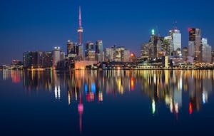
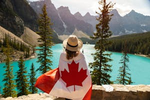

# A list of countries

## Pictures of Canada

## Table of contents

[Canada](#canada)
[India](#india)
[Zimbabwe](#Zimbabwe)

## Canada

- Alberta,
- British Columbia,
- Manitoba,
- New Brunswick,
- Newfoundland and Labrador,
- Nova Scotia,
- Ontario,
- Prince Edward Island,
- Quebec
- Saskatchewan
- Northwest Territories
- Nunavut
- Yukon

## India

Hello

## Zimbabwe
